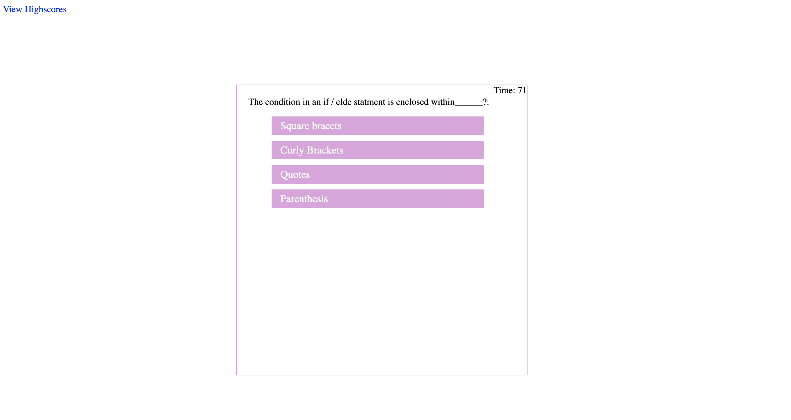

# Code_Quiz
In this applicatio you will be taking a Code Quiz. 
It is a timed quiz and the time will start when you hit start quiz. 
If you answer a question wrong time will be subtracted from the clock. 
The quiz will end when all questions are answered or when you complete all questions. 
You can save your score by putting in your initials.  

## Below is the link for the Code Quiz 
* https://lindseybowen.github.io/Code_Quiz/

## Screen Shots 

